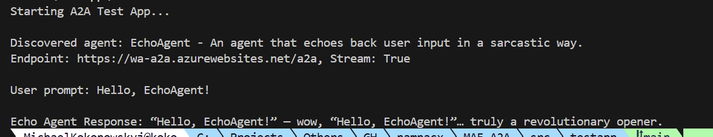

## 🚂 Some Context First

If you read my [other post about integrating an A2A agent into Copilot Studio](/posts/integrating-a2a-agent-copilot-studio), you know how this started: a chat with friends at Microsoft, an interesting scenario, and a quick decision to try something I had never done before.

Before I could wire anything into Copilot Studio though, I first needed an actual A2A-capable agent to integrate. Something running on Azure, talking the A2A protocol, ready to be consumed.

So: how hard is it to build one in .NET?

Spoiler: embarrassingly easy.

The repo is here: [nampacx/MAF-A2A](https://github.com/nampacx/MAF-A2A)

## 🤖 Quick Primer: What Are A2A and MAF?

**A2A (Agent-to-Agent)** is an open protocol that lets AI agents discover and communicate with each other — regardless of who built them or where they run. Think of it like a well-known REST contract for agent interop. An agent exposes an `AgentCard` (its service contract) and endpoints to send/receive messages.

**MAF (Microsoft Agent Framework)** is Microsoft's .NET SDK for building AI agents. It handles the plumbing of LLM communication, tool use, conversation management — so you can focus on what the agent actually does.

Put them together and you get an agent that any A2A-compatible client can discover and talk to. Including Copilot Studio. 😏

## 🏗️ What We're Building

The project has three parts:

```
iac/        Bicep infra + deploy scripts
src/
  webapi/   ASP.NET Core app exposing the A2A endpoint
  testapp/  Console app to verify it all works
```

The agent itself is deliberately simple — an `EchoAgent` that repeats back whatever you say, but sarcastically. Because why not. It's a great test case: the interesting part is the A2A wiring, not the agent logic.

## 🧠 Step 1: Create the Agent

With MAF, creating an agent is a few lines. You grab a chat client backed by Azure OpenAI and wrap it in a `ChatClientAgent`:

```csharp
private static AIAgent CreateEchoAgent(ConfigurationService configurationService)
{
    var azureClient = new AzureOpenAIClient(
        configurationService.Endpoint,
        configurationService.Credential);

    var chatClient = azureClient
        .GetChatClient(configurationService.ModelDeployment)
        .AsIChatClient();

    return new ChatClientAgent(chatClient, new ChatClientAgentOptions
    {
        Name = "EchoAgent",
        ChatOptions = new()
        {
            Instructions = "You are an echo agent. Repeat back whatever the user says in a sarcastic way."
        }
    });
}
```

That's your agent. MAF handles the rest — turn management, message history, LLM calls.

## 🃏 Step 2: Define the AgentCard

The `AgentCard` is the A2A equivalent of a service contract. It's what clients discover first to find out who you are and what you can do:

```csharp
private static AgentCard GetAgentCard()
{
    return new AgentCard
    {
        Name = "EchoAgent",
        Description = "An agent that echoes back user input in a sarcastic way.",
        Version = "1.0.0",
        Provider = new AgentProvider
        {
            Organization = "nampacx",
            Url = "https://github.com/nampacx"
        },
        DefaultInputModes = ["text/plain"],
        DefaultOutputModes = ["text/plain"],
        Capabilities = new AgentCapabilities
        {
            Streaming = true,
            PushNotifications = false
        }
    };
}
```

Simple, declarative, and it doubles as documentation. Any A2A client — or Copilot Studio — can call the well-known discovery endpoint and get this card back automatically.

## 🔌 Step 3: Wire It Up (the Two Lines Part)

This is the bit that genuinely surprised me. In `Program.cs`, registering the agent and exposing all A2A endpoints is this:

```csharp
var (agentCard, aiAgent) = app.Services.GetRequiredService<EchoAgent>().GetAgent();

app.MapA2A(aiAgent, "/a2a", agentCard, taskManager =>
    app.MapWellKnownAgentCard(taskManager, "/a2a"));
```

Two lines. That's it. 🎉

`MapA2A` registers the message-handling endpoint. `MapWellKnownAgentCard` exposes the card at `/.well-known/agent.json` so clients can auto-discover the agent. The MAF A2A extensions do all the heavy lifting — serialization, task lifecycle management, streaming — you just tell it where to hang the endpoints.

## ☁️ Step 4: Deploy to Azure

The `iac/` folder has Bicep that sets up:

- **Azure AI Foundry** with a model deployment (`gpt-5.3-chat`)
- **Linux App Service** (B1) to host the web API
- **Role assignment** so the web app's managed identity can call the AI service — no keys, no secrets to manage 🔐

Deploy is two PowerShell scripts:

```powershell
# Stand up the Azure resources
cd iac
.\deploy.ps1

# Deploy the app
.\deploy-app.ps1
```

The managed identity setup is worth calling out specifically. No connection strings, no API keys floating around in environment variables. The app authenticates to Azure OpenAI via `DefaultAzureCredential` and the role assignment in Bicep handles the permissions. Clean.

## 💬 Step 5: Verify With the Test App

The repo includes a console test app that runs the full A2A client flow — discover the card, send a message, print the response:

```csharp
// Discover the agent via its well-known card endpoint
var resolver = new A2ACardResolver(new Uri("https://wa-a2a.azurewebsites.net/a2a"));
var echoAgentCard = await resolver.GetAgentCardAsync();
Console.WriteLine($"Discovered agent: {echoAgentCard.Name} - {echoAgentCard.Description}");

// Send a message
var echoClient = new A2AClient(new Uri(echoAgentCard.Url));
var echoRequest = new AgentMessage
{
    Role = MessageRole.User,
    MessageId = Guid.NewGuid().ToString(),
    Parts = new List<Part> { new TextPart { Text = "Hello, EchoAgent!" } }
};

var response = (AgentMessage)await echoClient.SendMessageAsync(
    new MessageSendParams { Message = echoRequest });

Console.WriteLine($"Echo Agent Response: {((TextPart)response.Parts[0]).Text}");
```

Running `dotnet run` from `src/testapp` gives you a live end-to-end test: card discovery, message send, response received. It's also exactly what I used to verify the agent was working before wrestling with Copilot Studio.



## 🏁 Conclusion

The whole thing was surprisingly fun to build — and faster than I expected. The key takeaways:

- **MAF handles the agent logic and LLM plumbing** — you focus on the `Instructions` and let the framework do the rest
- **A2A wiring is literally two lines** in `Program.cs` thanks to the MAF A2A extensions
- **The `AgentCard`** is your service contract — define it once and clients can auto-discover everything
- **Bicep + managed identity** keeps the infrastructure clean and keyless
- **The test app is gold** — having a dedicated client to smoke-test your A2A endpoints before integrating anywhere is genuinely useful

If you want to expose a .NET AI agent for other agents or platforms to consume, MAF + A2A is a very elegant combo. The protocol handles the interop story, MAF handles the agent story, and Azure handles the hosting story.

And then you can wire the whole thing into Copilot Studio in about 10 minutes. But that's [a different post](/posts/integrating-a2a-agent-copilot-studio). 😄
