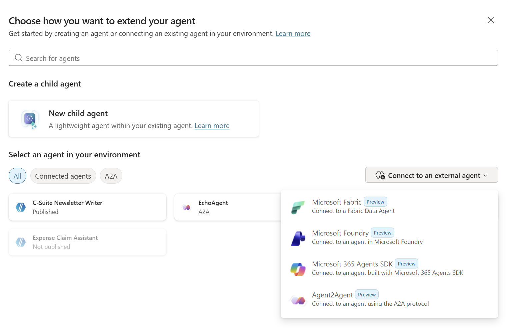
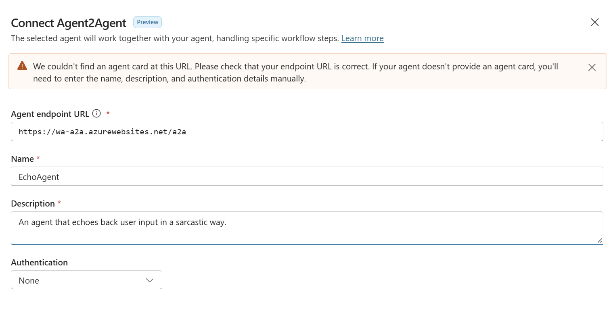
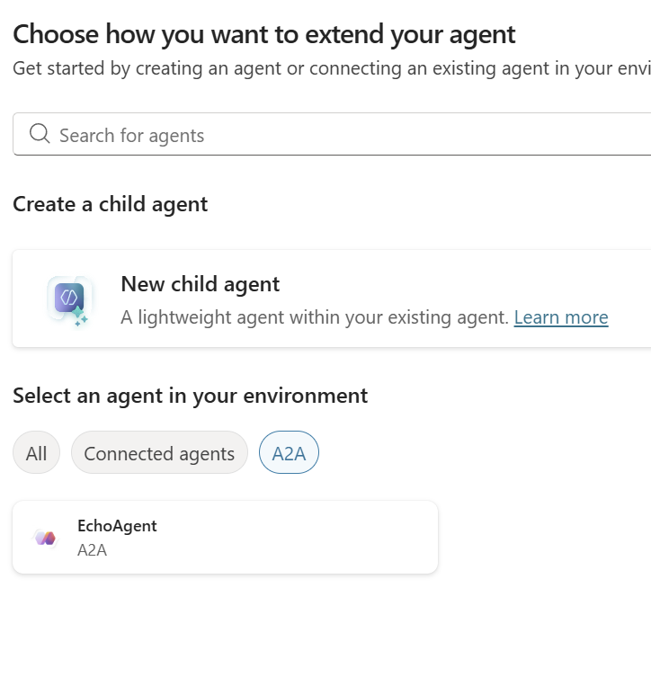
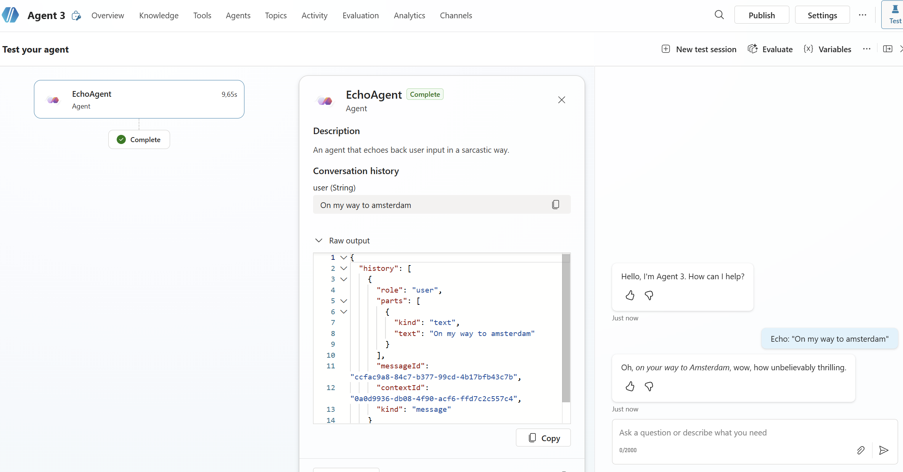

## 🗣️ The Conversation That Started It All

Mid-week, I had the chance to meet some old colleagues and friends, and as usual, at some point the conversation drifted to work—and then to AI. No surprises there.

The scenario they described was interesting: they have a web solution with a frontend that collects some data and sends it to an AI agent to do... things with it. The question was how to integrate that agent into Copilot Studio to deploy it to M365.

My immediate thought: **Why not create an agent in Copilot Studio and simply add an A2A agent to it?**

I had never actually done it before, but I had seen the option in the UI.

We agreed it was probably a good idea. Not sure how they'll proceed, but since I had never deployed an A2A integration before — and also hadn't used MAF (Microsoft Agent Framework) — I figured it would be a nice thing to try myself.

## 🛠️ Building the A2A Echo Agent

First step: develop an echo agent webapp hosted on Azure that exposes A2A endpoints.

The result is here: [nampacx/MAF-A2A](https://github.com/nampacx/MAF-A2A)

Honestly, it was a lot of fun to build. 😄 Something refreshingly different compared to what I had been doing in the weeks before. MAF made it straightforward to get an A2A-compatible agent up and running in .NET, and deploying it to Azure was the easy part.

## 🔌 Wiring It Into Copilot Studio

With the agent deployed, I only needed to integrate it into a Copilot agent — and that turned out to be equally straightforward.

All I had to do was add the URL pointing to the A2A endpoint:

### 🃏 The Agent Card Hiccup

I noticed that Copilot Studio returned an error saying it couldn't find the Agent Card. Strange, because the test app I built could read the card without any issues:

The workaround was simple — I just entered the name and description manually and clicked through the rest of the wizard. A minor speed bump, nothing more. 🚧

To be fair, A2A support in Copilot Studio is currently in **preview**, so a few rough edges like this are to be expected. Preview features aren't perfect — that's kind of the point.

## ✅ Selecting and Testing the Agent

After completing the wizard, the A2A agent showed up ready to use:

Then I tested it using the built-in test chat in Copilot Studio:

It worked. 🎉

> **Worth noting:** The first time you interact with the A2A agent, Copilot Studio will ask you to add a connection. The chat provides a direct link to do so — after that, everything flows smoothly.

*(Also worth noting: this entire experiment was done while connectivity on a Deutsche Bahn ICE to Amsterdam was being... let's say, character-building. But it still worked.)*

## 🏁 Conclusion

Integrating an A2A agent built with Microsoft Agent Framework into Copilot Studio was surprisingly smooth. The process is:

1. Build and deploy your agent webapp with A2A endpoints (MAF on .NET makes this straightforward)
2. In Copilot Studio, add the A2A agent by URL
3. If the Agent Card auto-detection fails, enter the details manually — no big deal
4. Add the connection when prompted in the test chat

The whole thing gave me a great excuse to dig into both A2A and MAF on .NET. 🤓 If you have an existing agent you want to surface in Copilot Studio and M365, this is a very viable path. 🚀

Keep in mind that A2A integration in Copilot Studio is still a **preview feature**, so the occasional hiccup (like the Agent Card detection issue) comes with the territory. But given that it's preview, the overall experience was remarkably smooth — I had a working end-to-end integration in a single sitting on a train with spotty internet. That says a lot.
